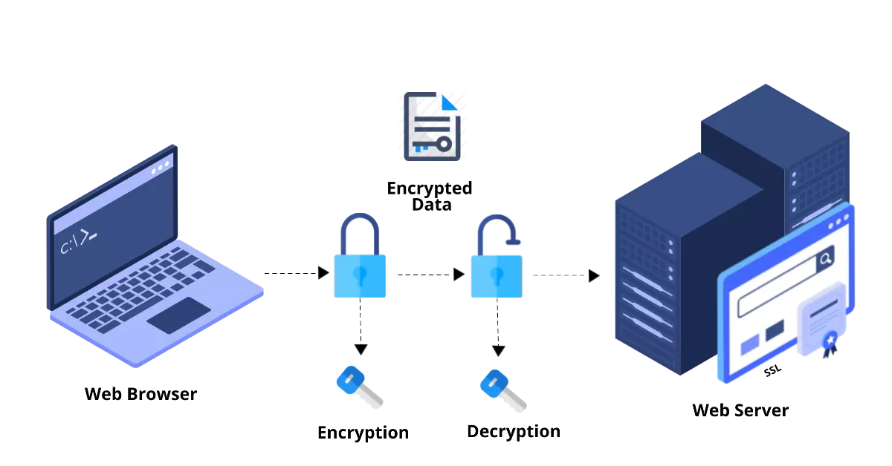
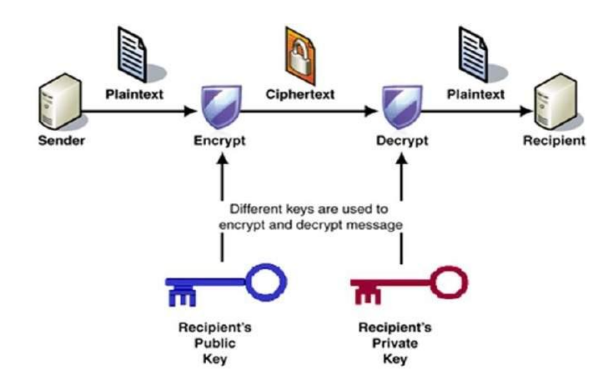
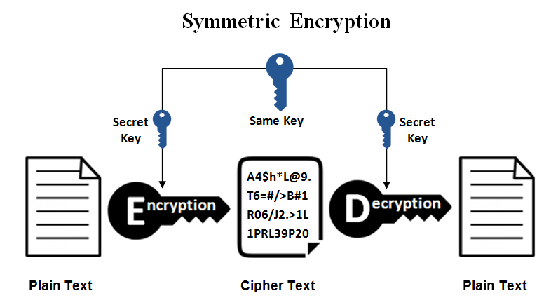
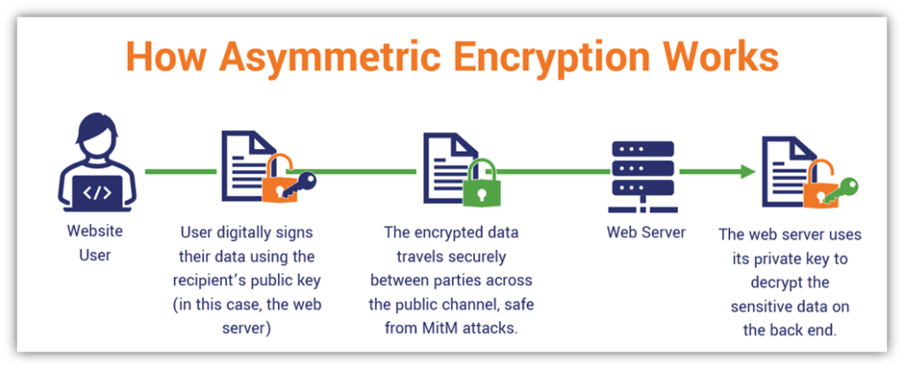
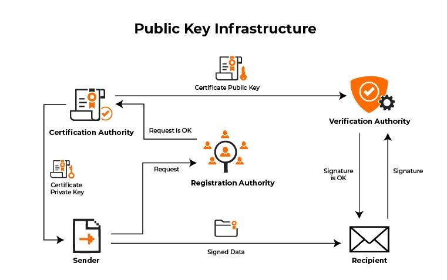
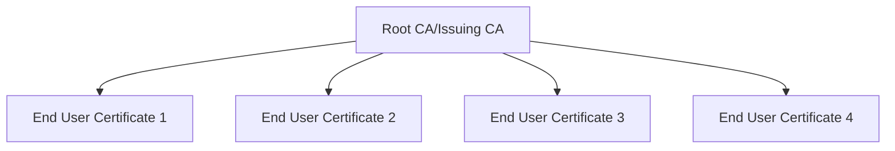
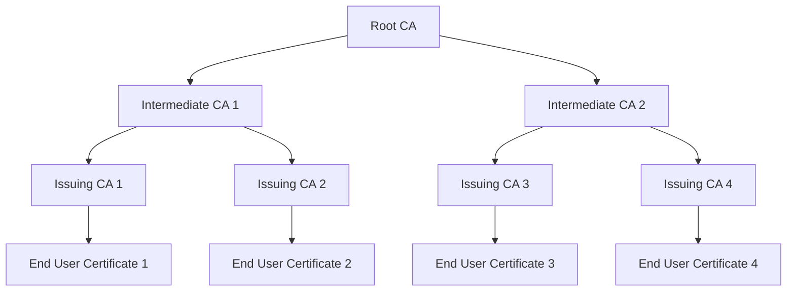
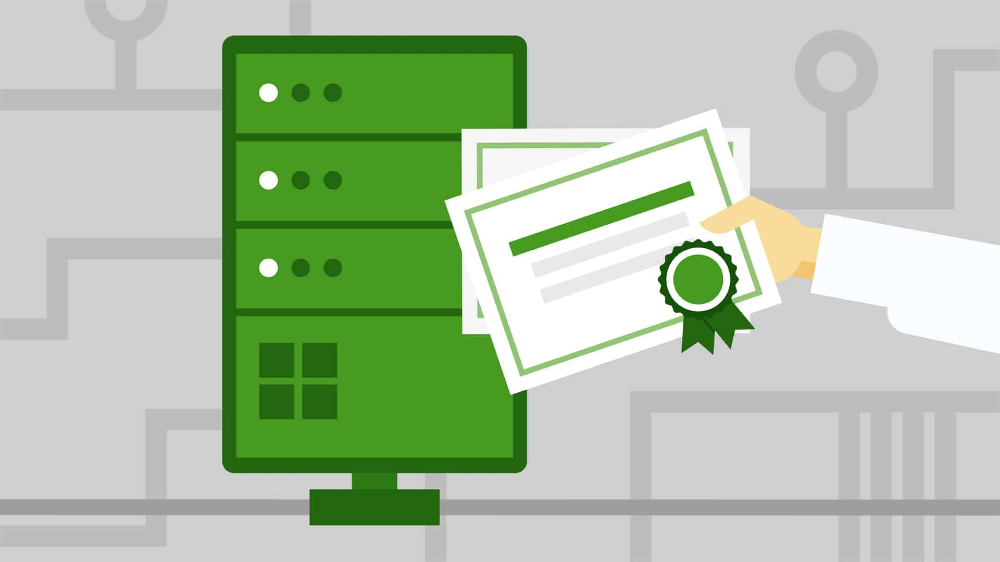

# SSL/TLS: Seuring Network Communication

  .svg)

## Cryptography Overview

- SSL and TLS are cryptographic protocols that provide security for network communications.

- TLS supersedes SSL and is the current standard for secure communication.

- Cryptography is the method of securing data such that it's trusted and is accessible only by authorized parties.

  

- Cryptographic Keys need to be stored somewhere in order to partake in securing things like network communication or data at rest.

- One way to store cryptographic keys is in a Public Key infrastructure(PKI) certificate.

- Keys can also be stored on a smart card or a hardware security module(HSM). Smart cards would be used for instance to authenticate to a VPN or perhaps to authenticate to a secured or restricted system. Common access cards(CAC) are a type of smart card, but they can do more, and so that card that we use to authenticate to restricted computer systems or VPN might also be the same card we use to gain access to a building.

- Cryptographic Keys can also be stored in files. Depending on the type of key you are storing such as a private key we want to make sure that is a password-protected file, because it's private to the enetity to which it was issued. It's not designed to be shared with others. And, that's why that file containing the private key be password-protected, but it should also be stored in a secure location.

- Trusted Platform Model(TPM) is a firmware and this firmaware can store cryptographic keys that are used to encrypt or decrypt entire disc volumes. TPM can also store information about the startup sequence on a machine, and if it's been tampered with TPM can detect it.

- Cryptographic keys can also be stored on token devices, which can be a physical token, such as a key fob device that's used to gain access to a restricted environment, or system.

- Token devices these days can be virtual as well, like a smartphone app, but either way these token devices can store PKI Certification information, including keys in order to enable security.

- The General Encryption Process starts with plain text, plaintext is origin data before it's been encrypted or scrambled. And, so that plaintext gets fed into a encryption algorithm along with the key. The result of which is encrypted data, otherwise known as ciphertext.

  So, once the data is encrypted such as sending data over the network, this would happen before it's sent out over the wire or wirelessly. So, while it's traversing the network, if the data is encrypted, anyone that can see the network traffic or capture it would normally be able to see the addressing onformation in the transmission.

  Because normally, encryption over the network would encrypt only the payload or the data of the packet. We can encrypt more than that but that's the general norm.

- Only, those parties that having the required  decryption key would be able to decrypt the ciphertext back into plaintext.
  
  

## Where is Cryptography Used?

- Well, let's take a couple of few simple examples but alos on a mobile device.

- We might encrypt all of the contents of the mobile device itself including any removable mediua like MicroSD cards.

- We can use crypto to encryp the file system for protection of data at rest.

- We can also use it to encrypt network traffic, such as encrypting http-secured website.

- We can use cryptography for file hashing, where we can generate a unique file hash or value, and than compare that in future when we take the hash again to the orignal hash, to see if a change has been made.

- We can also use cryptography with cryptocurrency blockchain transactions.

## Symmetric Encryption

- Symmetric encryption, also known as symmetric cryptography, is a type of encryption where the same key is used for both encryption and decryption of data.

- This is in contrast to asymmetric encryption, where two different keys (a public key and a private key) are used.

- Symmetric encryption is widely used because it is generally faster and more efficient for encrypting large amounts of data.

- The `Secret Key` is a critical component of the symmetric encryption process.

  - It is a string of characters used to encrypt and decrypt data.
  - The security is completely relied on the security of this key itself.
  - If the key is compromised, the data can be decrypted by aany third party.

  

- There are couple of algorithms that are used for symmetric encryption, such as:

  - `AES` (Advanced Encryption Standard)

    - Most Widely Used Symmetric Encryption Algorithm.
    - Known for High Efficiency and Security.
    - Supports key size of 128, 192, and 256 bits.

  - `DES` (Data Encryption Standard)

    - Popular Symmetric Encryption Algorithm in the past
    - Considered less secure due to shorter key length (56 bits)
    - It's now been replaced by AES

  - `3DES` (Triple Data Encryption Standard)

    - To improve the performance of DES, `3DES` applies the DES algorithm three times to each data block with 3 different keys.
    - This increases security but reduces performance.

  - `Blowfish`

    - Known for speed and effectiveness.
    - It uses a variable key length, making it flexible for different security needs.

- Modes of Operation of Symmetric Encryption:

  - `ECB` (Electronic Codebook)

    - Each block of data is encrypted separately.
    - Identical plaintext blocks are encrypted into identical ciphertext blocks.
    - Vulnerable to attacks.

  - `CBC` (Cipher Block Chaining)

    - Each block of data is XORed with the previous ciphertext block before encryption.
    - Initialization Vector (IV) is used to ensure that identical plaintext blocks do not encrypt to identical ciphertext blocks.

  - `CFB` (Cipher Feedback)

    - Each block of data is encrypted and then XORed with the plaintext block to produce the ciphertext block.
    - The previous ciphertext block is used as the Identity Vector (IV) for the next block.
    - These are stream modes that turn blcok ciphers into stream ciphers, which encrypt data 1 bit or byte at a time.

  - `OFB` (Output Feedback)

    - Each block of data is encrypted and then XORed with the plaintext block to produce the ciphertext block.
    - The previous ciphertext block is used as the IV for the next block.

  - `CTR` (Counter)

    - Each block of data is encrypted by XORing it with the output of a counter function.
    - The counter function generates a unique value for each block.

- Security Considerations:

  - Symmetric encryption is fast and efficient, but it is only secure if the key is kept secret. So, the keys must be stored securely and rotated or changed at regular intervals.

  - Common attacks on symmetric encryption include brute force attacks, where an attacker tries all possible keys to decrypt the data.

- Uses of Symmetric Encryption:

  - Symmetric encryption is used in many applications, including secure communication, data encryption, and file encryption.

  - It is also used in secure protocols such as SSL/TLS, IPsec, and SSH.

  - Applications such as Messaging Apps, VPNs, and Secure Email use symmetric encryption to protect data.

- Advantages of Symmetric Encryption:

  - Fast and efficient for encrypting large amounts of data.
  - Secure if the key is kept secret.
  - Widely used in many applications.
  - Use of single key simplifies the encryption process.

- Disadvantages of Symmetric Encryption:

  - Key management is a challenge, as keys must be stored securely and rotated regularly.
  - Vulnerable to brute force attacks if the key is weak.
  - Not suitable for secure communication between parties that do not share a common key.
  - In a network, with multiple participants, each pair of users need to a share a unique key, leading to large number of keys to manage.

## Asymmetric Encryption

- Asymmetric encryption, also known as public-key encryption, is a type of encryption where two different keys are used for encryption and decryption.

- One key is used to encrypt the data (public key), and the other key is used to decrypt the data (private key). These keys are mathematically related but are not the same, they serve different purposes in the encryption and decryption process.

  

- The `Public Key` is used to encrypt data and is shared with others, while the `Private Key` is used to decrypt the data and is kept secret.

- `Public Key`

  - used to encryp the messages
  - made available to anyon
  - anyone can use it to encrypt data

- `Private Key`

  - used to decrypt the messages
  - kept secret by the owner
  - only the owner can decrypt the data and view the original message

- Functioning of Asymmetric Encryption:

  - Key Generation:

    - A `Key Pair`(Public & Private Key) is generated using complex mathematical algorithms like RSA, DSA, or ECC.
    - The Public key is shared, while the Private Key is kept secured.

  - Encryption:

    - When someone wants to send the message, it uses the public key ot encrypt the message.
    - The Encrypted Messaage can only be accessed by the recipient who has the corresponding private key.

  - Decryption:

    - The Recipient uses their private key to decrypt the message, transforming it to orignal data.
    - Even if the message is intercepted, it cannot be decrypted without the private key.

- Popular Algorithms for Asymmetric Encryption:

  - `RSA` (Rivest-Shamir-Adleman)

    - Most widely used asymmetric encryption algorithm.
    - Named after its inventors.
    - Supports key sizes of 1024, 2048, 3072, and 4096 bits.
    - Downside is that it's slower due to huge key sizes.

  - `DSA` (Digital Signature Algorithm)

    - Used for digital signatures and key exchange.
    - Developed by the US National Security Agency (NSA).
    - Supports key sizes of 1024 and 2048 bits.

  - `ECC` (Elliptic Curve Cryptography)

    - Uses the mathematical properties of elliptic curves for encryption.
    - Provides the same level of security as RSA with smaller key sizes.
    - Supports key sizes of 160, 192, 224, 256, 384, and 521 bits.

- Security Considerations:

  - The Private Key must be kept secured at all times, as it is used to decrypt the data. Secure storage and management of private keys are essential.

  - Assysmetric Encyption is prone to Man-in-the-Middle attacks, where an attacker intercepts the communication between two parties and alters the data, so the authenticity of the Public Key must be verified.

  - Without proper authenticity, an attacker could distribute their own public key, causing users to encrypt data with the attacker's key, which can then be decrypted by the attacker.

  - PKI (Public Key Infrastructure) is used to manage the distribution and verification of public keys, ensuring the authenticity of the keys. It includes mechanism for Key revocation, distribution, and renewal.

  - CAs (Certificate Authorities) are trusted entities that issue digital certificates to verify the identity and integrity of the public key.

  - Generally slower than symmetric encryption due to the complexity of the algorithms and larger key sizes.

- Uses of Asymmetric Encryption:

  - Used in HTTPS Communication to secure web traffic.

  - Used in Email Encryption to protect sensitive information. Protocols like S/MIME and PGP use asymmetric encryption.

- Advantages of Asymmetric Encryption:

  - Secure communication between parties that do not share a common key.
  - Public Key can be shared with anyone, while the Private Key is kept secret.
  - Supports digital signatures and key exchange.

- Disadvantages of Asymmetric Encryption:

  - Slower than symmetric encryption due to larger key sizes

## PKI (Public Key Infrastructure) Hierarchy

- Securing Network Communication with TLS/SSL begins with Public Key Infrastructure (PKI) Hierarchy.
- Public Key Infrastructure (PKI) is a collection or hieearchy of digital security certificates.
- And, these certificates that we define among other data, contain the public key.
- Also, certificates might contain mathematically related private key, but that private key is not shared.
- If Private Key is not stored within the certificate, it can be stored in a seprate file or on a hardware security module (HSM).

### PKI Components:

  

- **`CAs (Certificate Authorities)`**

  - Trusted entities that issue New digital certificates to devices, applications, or users.
  - Verify the identity of the certificate holder.
  - Issue certificates for a specific period of time.
  - Maintain a Certificate Revocation List (CRL) of revoked certificates.

- **`Registration Authorities (RAs)`**

  - Also known as Subordinate CAs.
  - It exists underneath the CA in the PKI hierarchy.
  - Verify the identity of the certificate holder before issuing a certificate.
  - Forward the certificate request to the CA for issuance.
  - Handle the registration process for certificate requests.

- **`Certificate Revocation List (CRL)`**

  - Also known as Online Certificate Status Protocol (OCSP).
  - Used to verify the validity of a certificate.
  - A list of certificates that have been revoked by the CA before their expiration date.
  - Contains the serial number of the revoked certificate and the reason for revocation.

- **`Certificate Templates`**

  - It's a blueprint that can be used when issuing the certificates, and can be customized depending on the needs.
  - Defines the format and content of the certificate.
  - Contains information such as the subject name, key usage, and validity period.
  - Used to create new certificates based on predefined templates

- **`Certificate`**

  - A digital certificate is a file that contains the public key, the identity of the certificate holder, and the digital signature of the CA & RA.
  - It is used to verify the identity of the certificate holder and establish secure communication.
  - Contains information such as the subject name, public key, validity period, and the digital signature of the CA.

### Single Tier PKI Hierarchy:

- We can setup PKI within an Organization in a single-tier hierarchy.
- That means at the top of the hierarchy we would configure CA.
- And, directly, from it we would issue certificates for users, devices or applications. And each certifacte results in a Public Key and a Private Key, that may or may not be stored in the certificate.
- The Public and Private Key for each certificate is unique, so we don't get the same publci certificate for all the issued certificates.

### Multi-Tier PKI Hierarchy:

- We might also choose to use a Multi-Tier PKI Hierarchy, where at the top we have the Root CA, under which we have Registration Authorities (RAs)/Subordinate CAs.
- And, than these RAs will issue certificates to users, devices or applications.
- We can keep the Root CA offline, and use the Subordinate CAs for day-to-day certificate issuance, unless we need to create a new RA or Subordinate CA. Because, if the CA is compromised, all the RA and Subordinate CAs under it are also compromised, resulting in a complete PKI compromise. However, if only the RA/SCA is compromised, only the certificates issued by that RA/SCA are compromised.

## Certificare Authourities (CAs)

- Certificate Authorities are a crucial part of the PKI hierarchy.

- Certificate or Registration Authorities, depending on where they exist in the hierarchy, have a longer validity period than a standard-issued certificate.

- They have a longer validity period because they are used to sign other certificates, and if they expire, all the certificates they have signed would also be considered invalid.

- This is determined when you configure your environment where certificates are issued if you are setting up a PKI. The Certificate or Registration Authority then can issue new certificates, can renew certificates before they expire, and can also revoke certificates due to things like security compromise. 

- The authorities can also publish a certificate revocation list, or a CRL, over a variety of protocols, including things like http, and this certificate revocation list can then be retrieved by clients before they partake in communication that would use PKI certificates because if there are revoked certificates, they don't want to communicate with anything related to that for security purposes. 

- Now, CAs, or Certificate Authorities, at the very top of the hierarchy, the Root CA as it's called, can issue certificates to subordinate Registration Authorities, or RAs, and then in turn, the RAs can issue entity certificates to users, devices, and software, so a compromised top-level CA, or, as we're calling it, the Root CA, means that all subordinate certificates would be compromised. 

- In a **Single-Tier PKI Hierarchy**, we know that we've got the CA, or the Certificate Authority, at the top, and it can issue certificates, but what we have here is a chain of trust, and what that means is that the digital signature of the Certificate Authority will exist in all of the certificates that it issues, and that's called chain of trust. In other words, if we trust the Certificate Authority, we trust all of the certificates that it has issued. 

- The same concept also works well with the **Multi-Tier PKI Hierarchy**, where you've got a Certificate Authority at the top, the Root CA, and then subordinate Registration Authorities that issue certificates.

  - Now, in this case, we know that the Root CA should be kept offline for security purposes because if it's compromised, everything in the hierarchy's compromised.

  - Now, when will we work with Registration Authorities, or, as they call them, subordinate Certificate Authorities.
  - You might have RAs for different departments within the organization, or for different projects, for child companies, or even for different geographic regions, so this way you would make sure that the appropriate administrative team, IT admin team, has the appropriate Registration Authority, and they can issue their own certificates.
  - Now, these certificates, as we know, can be issued to users, devices, or applications, and, again, here we have a chain of trust, except on multiple levels compared to our previous discussion a moment ago.
  - What this means, then, is that if we trust the Certificate Authority at the top, the Root CA, then by extension, we will trust Registration Authorities under it and all of the certificates that those Registration Authorities issue.

- This chain of trust is important because software will check this. For example, your web browser has a list of trusted certificates that it uses to determine whether you're connected to a site that is trusted or not, and most web browsers will tell you, you've probably seen this, that it might not be able to verify the identity of the site or the site is not to be trusted. As an example, take a look at this sample web page. We have a message that says our connection is not private, and, up in the address bar, https is crossed out because it's not a secured or safe connection, and if I click up here, this is the Google Chrome browser, by the way, if I click where it says not secure, I can also click on the certificate, which it's saying is invalid, it says the certificate is expired. Well, indeed, I can see that the validity date here is back in 2015, so certainly, yes, the certificate has expired, and that's why my web browser is resulting in these messages. The chain of trust, then, is very important in a Public Key Infrastructure Hierarchy, so that CAs need to be trusted, otherwise PKI is meaningless.

  

- Certificates, as we know, contain the digital signature of the issuing Certificate Authority.

- The thing about this is that digital signatures are created with that entity's private key, so the private key of the Certificate Authority, so that key is kept private and secured and is not easily spoofed, and that's why we can trust that digital signature.

- Digital signatures get verified, by the way, using the related public key, so if the Certificate Authority digitally signs a certificate with its private key, we can verify that signature with the authority's public key.

- We can also, though, use self-signed CAs within your organization. This means, then, that you are creating your own Public Key Infrastructure. You're creating your own hierarchy instead of going out to some other organization that is trusted globally to issue certificates, and as a result, your self-signed Certificate Authority, by default, will not be in this Trusted Root Certification Authority list.

- Therefore, nothing will trust a self-signed CA by default. Therefore, CA certificates can be added to a device, to the trusted certificate store, to suppress warning messages.