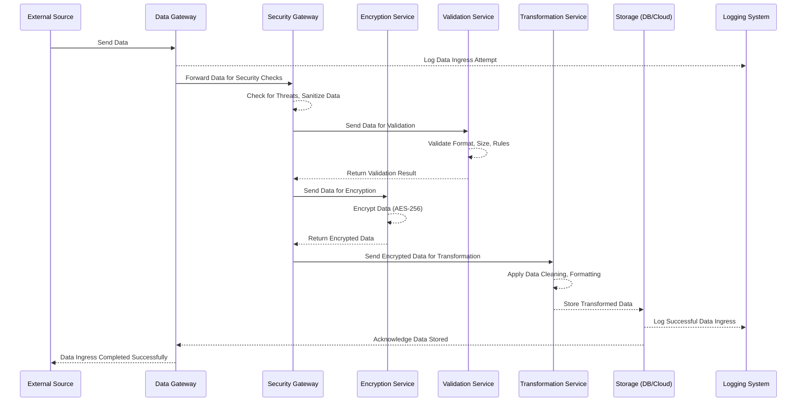

# SSL, TLS and HTTPS

- So when web server supplies you certificate, you verify signature in that certificate, you verify its validity, period, and so on.

- But certificate is not used itself for encryption of data between web browser and web server, and that's where SSL and TLS protocols come in.

- So, `SSL` stands for `Secure Sockets Layer`. `TLS` stands for `Transport Layer Security`. `TLS` & `SSL` is a cryptographic protocol that is used for secure communication over a computer network. And it is used primarily for encryption of data.

- Difference b/w `SSL` and `TLS` is that `TLS` is newer version of `SSL`. `TLS` is more secure and more reliable than `SSL`. And `TLS` is backward compatible with `SSL`.

- But what is the connection between SSL, TLS and certificate? Actually certificate itself is not dependent and does not set exactly which protocol either SSL or TLS must be used for data encryption.

- And it means that the same certificate may be used either for SSL or TLS.
So sometimes you hear such term as SSL certificate. So certificate doesn't depend on specific protocol SSL or TLS.

- So each certificate may be used either for SSL or TLS, but if you want to be more specific and tell others that you are talking about digital certificates that are used for encryption, you can add prefix SSL, TLS like that.

- There are total 3 versions of SSL protocol: `SSL 1.0`, `SSL 2.0`, `SSL 3.0`. And there are total 3 versions of TLS protocol: `TLS 1.0`, `TLS 1.1`, `TLS 1.2`, and `TLS 1.3`.

- SSL is currently considered to be a deprecated protocol, and it is not recommended to use it. And it is recommended to use TLS protocol instead.

- Even with the TLS protocol, it is recommended to use the latest version of TLS protocol, which is `TLS 1.3`.

### Why RSA is not used for data encryption in HTTPS?

- RSA is not used for data encryption in HTTPS because it is slow. RSA is used for key exchange and digital signatures in HTTPS.
- Also, Bi-directional encryption is not possible with RSA as it will require RSA Key Pairs on both sides.
- RSA is a symmetric key algorithm, and it is not suitable for bulk data encryption.
- While on the internet, we generally deal with scenarios that require asymmetric encrytpion.

### How TLS Session is established?

- When a client connects to a server via HTTPs, when TCP session is established, we start establishing a TLS Session.

- Web Browser first sends to Web Server a list of supported suites, and the server chooses the best Cipher Suite from this list. This step is called `Negotiation of Cipher Suite`.

- `Cipher Suite` is a combination of encryption, authentication, and message authentication code (MAC) algorithms used to secure data. It is a set of protocols that will be used in TLS Communication.

- For example, each Cipher Suite defines how symmetric key for data encryption will be generated. Also, it defines which algorithm will be used for data encryption and decryption. It also includes information about the Hashing Algorithm that will be used for data integrity.

- The server sends its certificate to the client/browser. If there are any Intermediate CA, they are also sent to the client.

- The client/web-browser verifies the certificate and generates symmetric key for data encryption.

  In some cases symmetric key is generated on web browser side and sent to the server in encrypted form, encrypted by the public key of the server.

  Another way of Generating Symmetric Key is by utilizing the Diffie-Hellman Key Exchange Algorithm. And, this case the communucation doesnot need to be encrypted, as it is designed for generation of same key on both sides.

  When both sides have same encryption key, we can start sending and reciving actual data from server to browser and vice versa.

## Analyzing TLS Session using WireShark

- So, let's do it for `wikipedia.org`. Let's open wikipedia.org in web browser and let's see how TLS session is established.

- On the `WireShark` select the network interface that you are using to connect to the internet, for our it is `Wi-Fi`, and stop the capture.

- Now, filter by ip address using `ip.addr == <ip_addr/>`

  

  And, here in the image as we can see we see three TCP packets, this is what is also known as `Three-way Handshake`.

  So, first our computer sends a request for the TCP Session. The TCP server responds with flags `SYN`(Synchronize) and `ECN`(Explicit Congestion Notification). And, then our computer responds with `SYN` and `ACK` flags.

  ECN is a feature that allows end-to-end notification of network congestion without dropping packets. It is an optional feature that is only used when both endpoints support it and are willing to use it.

  The Server responds with `ACK` flag, and acknowledges the session setup. After, that our  computer sends another `ACK` flag to acknowledge the session setup, after which the `TCP` session is established.

  

  After this, we see our first TLS Packet. We  see TLS 1.3 - Handshake Protocol - Client Hello. This is the first packet of the TLS Session marked as `Client Hello`.

  Here we see the `Cipher Suites` that are supported by our web browser. And, the server will choose the best Cipher Suite from this list. We have `16` Cipher Suites in our case, that was sent by our web browser to the server.

  The Server Suites names are of the format `Communication Protocol - Key Exchange Algorithm - Cipher Algorithm - Hash Creation Algorithm`.

- Now, We see a response from the server in this regard with TLS Packet marked as `Server Hello`.

  

  We again see the TLS Version 1.2 - Handshake Protocol - Server Hello. This time we have a Session ID, and the Cipher Suite that was chosen by the server for this particular session.

- Looking at the next packet, we see the `Certificate` packet. This is the certificate that is sent by the server to the client.

  It is marked as `Handshake Protocol - Certificate`. Inside Handshake Protocol, we have multiple certificates, and we can see the certificate chain.

- Next, we see the `Certificate Status, Server Key Exchange` packet. This is the packet where the server sends the public key to the client.

  It is marked as `Handshake Protocol - Server Key Exchange`. Inside this packet, we have the public key of the server.

  It confirms here that the `Server Hello Done` packet is sent by the server.

- Next, we see the `Client Key Exchange` packet. This is the packet where the client sends the symmetric key to the server.

  This packet comes from the client to the server, and it is marked as `Handshake Protocol - Client Key Exchange`. And, in this messages clients tells the server which algorithm was used for secure key generation.

  And, along with this it send encrypted handshake message.

- After this, clients sends packet marked as Application Data. This is the actual data that is sent from the client to the server encrypted application data.

  After these packets, we see the response from the server.

  It is marked as `Application Data`. And, this is the actual data that is sent from the client to the server.

  

## TLS Termination

- `TLS Termination` is the process of decrypting the encrypted data that is received from the client, and then sending it to the server in unencrypted form.

- `TLS Termination` is done by either by the Gateway/Load Balancer/Reverse Proxy Server. The Gateway/Load Balancer/Reverse Proxy Server is responsible for decrypting the encrypted data, and then sending it to the server in unencrypted form.

  It is also responsible for encrypting the data that is sent from the server to the client.

- `TLS Termination` is done to reduce the load on the server. The server does not have to do the decryption of the encrypted data or encryption of the data that is sent to the client. And, let's the server focus on other tasks.

- The process involves exchanging the symmetric key between the client and the Gateway/Load Balancer/Reverse Proxy Server in order to decrypt the encrypted data.

  The Symmetric Key is then used to decrypt the encrypted data that is received from the client, and encrypt the data that is sent to the client.

- The Gateway/Load Balancer/Reverse Proxy Server has the private key of the server, and it uses this private key to decrypt the encrypted data that is received from the client.

    ```mermaid
    graph LR
        A[Client] -->|TLS/HTTPS Traffic| B[Load_Balancer/Gatway/Reverse_Proxy]
    B -->|Plain HTTP Traffic| C[Servers]

        style A fill:#a1f,stroke:#333,stroke-width:2px;
        style B fill:#f1e,stroke:#333,stroke-width:2px;
        style C fill:#a1f,stroke:#333,stroke-width:2px;
    ```

    <hr>

    ```mermaid
    flowchart TD
        A[Client] -->|TLS/HTTPS Traffic| B[Load_Balancer/Gateway/Reverse_Proxy]
        B -->|Plain HTTP Traffic| C[Server 1]
        B -->|Plain HTTP Traffic| D[Server 2]
        B -->|Plain HTTP Traffic| E[Server 3]
        
        subgraph F[TLS Termination]
            B
        end
        
        subgraph G[Backend Servers]
            C
            D
            E
        end

        style A fill:#a1f,stroke:#333,stroke-width:2px;
        style B fill:#f1e,stroke:#333,stroke-width:2px;
        style C fill:#a1f,stroke:#333,stroke-width:2px;
        style D fill:#a1f,stroke:#333,stroke-width:2px;
        style E fill:#a1f,stroke:#333,stroke-width:2px;
    ```

- This type of architecture is also known as `SSL Offloading` or `SSL Acceleration`. It is generally used in large scale applications where there are a large number of clients connecting to the server, requesting to a private server.

### Asymmetric and Symmetric Encryption in TLS Termination

- TLS combines both Asymmetric and Symmetric Encryption to ensure security, efficiency and authenticity.

- Asymmetric Exncryption:

  - Used in the initial phase of the TLS Handshake.
  - Involves the use of Public and Private Key Pair.
  - Used to exchange the Symmetric Key between the client and the server.
  - This is computationally expensive, but it is used only once in the beginning of the session.

- Symmetric Encryption:

  - Used to encrypt the actual data that is sent between the client and the server.
  - It is fast and less resource intensive, allowing for efficient data transfer.

- TLS Termination Step-by-Step Process:

  - Client-Server TLS Handshake (Asymmetric Encryption):

    - The client initiates a connection to the server by requesting a secure (TLS) connection.
    - The server (or load balancer) sends its TLS certificate (which includes the public key) to the client.
    - The client uses the public key to encrypt a randomly generated session key (symmetric key) and sends it back to the server.
    - The server (or load balancer) decrypts this with its private key, establishing a shared symmetric key for further communication.

  - Data Exchange using Symmetric Encryption:

    - Once the handshake is completed, the client and the server communicate using the shared symmetric key.

    - All data (web pages, API calls, etc.) is now encrypted using a symmetric encryption algorithm (e.g., AES) for efficiency.

  - TLS Termination:

    - The TLS-encrypted traffic reaches the load balancer (or TLS terminator).
    - The load balancer performs TLS termination by decrypting the symmetric-encrypted traffic.
    - The now plain (unencrypted) HTTP traffic is forwarded to the backend servers for processing.

  - Plain Text to Server:

    - The backend servers receive the unencrypted traffic, process the request, and respond to the load balancer in plain HTTP.

    - The load balancer may re-encrypt the traffic using the same or another TLS session before sending it back to the client, depending on the configuration.

  ```mermaid
    sequenceDiagram
    participant Client
    participant Load Balancer (TLS Terminator)
    participant Backend Server

    Client->>Load Balancer (TLS Terminator): ClientHello (Starts TLS Handshake)
    Load Balancer (TLS Terminator)-->>Client: ServerHello, TLS Certificate (Asymmetric)
    Client->>Load Balancer (TLS Terminator): Encrypt session key (Symmetric key) with server's public key
    Load Balancer (TLS Terminator)-->>Client: Handshake Complete (Session Key Agreed)

    Note right of Client: Data transfer (Symmetric encryption)

    Client->>Load Balancer (TLS Terminator): Encrypted Data (Symmetric)
    Load Balancer (TLS Terminator)->>Load Balancer (TLS Terminator): Decrypt data (Symmetric)

    Note right of Load Balancer (TLS Terminator): TLS Termination (Decryption)

    Load Balancer (TLS Terminator)->>Backend Server: Plain HTTP Request
    Backend Server->>Load Balancer (TLS Terminator): Plain HTTP Response
    Load Balancer (TLS Terminator)->>Client: Encrypted Response (Symmetric)
  ```

- In this way, TLS termination allows for secure, efficient, and scalable communication between clients and servers.

### How to establish TLS Termination:

- Establishing TLS Termination with NGINX

  - NGINX is a popular open-source web server and reverse proxy server that supports TLS termination.
  - Configure TLS Termination with NGINX:

    - Install NGINX on the server.

      - Ubuntu/Debian: Use the command `sudo apt install nginx`
      - CentOS/RHEL: Use the command `sudo yum install nginx`

    - Obtain a TLS/SSL certificate for your domain.

      - Use `Let's Encrypt` or purchase a certificate from a Certificate Authority (CA).

        - For `Let's Encrypt`, you can use the `Certbot` tool to obtain a free TLS certificate.

            ```bash
            sudo apt install certbot python3-certbot-nginx
            sudo certbot --nginx -d example.com
            ```

    - Configure NGINX to use the TLS certificate.

      - Edit the NGINX Configuration File, typically located at `/etc/nginx/nginx.conf` or `/etc/nginx/sites-available/default`.

      - Add the following lines to the configuration file:

        ```nginx
        server {
          listen 443 ssl; # Listens on port 443 for HTTPS traffic
          server_name yourdomain.com;

          # Path to SSL certificate and private key
          ssl_certificate /etc/letsencrypt/live/yourdomain.com/fullchain.pem;
          ssl_certificate_key /etc/letsencrypt/live/yourdomain.com/privkey.pem;

          # SSL settings for stronger security
          ssl_protocols TLSv1.2 TLSv1.3;
          ssl_ciphers HIGH:!aNULL:!MD5;

          # Proxy traffic to the backend
          location / {
              proxy_pass http://backend_server_ip:80;  # IP of backend server
              proxy_set_header Host $host;
              proxy_set_header X-Real-IP $remote_addr;
              proxy_set_header X-Forwarded-For $proxy_add_x_forwarded_for;
              proxy_set_header X-Forwarded-Proto $scheme;
          }
        }
        ```

    - Restart NGINX to apply the changes using the command `sudo systemctl restart nginx`.

## TLS Initiation

- `TLS Initiation` is the process of encrypting the data that is sent from the client to the server using the TLS protocol. This mainly happens during the TLS Handshake or where trying to send data from client to server.

- For example, in some cases where we send data from an internal network to an external network, we first send data to a Gateway/Load Balancer/Reverse Proxy Server, which then encrypts the data using the TLS protocol before sending it to the External server.

- `TLS Initiation` is done to ensure that the data is encrypted during transmission, providing confidentiality and security. It is also used to establish a secure connection between the client and the server.

- `TLS Initiation` involves use of Asymmetric Encryption to exchange the Symmetric Key between the client and the server, and then use of Symmetric Encryption to encrypt the actual data that is sent between the client and the server.

- `TLS Initiation` is an important step in securing data transmission over the internet, especially when sensitive information is being transmitted.

- `TLS Initiation` is also known as `TLS Encryption` or `TLS Handshake`.
- `TLS Termination` is the reverse process of `TLS Initiation`, where the encrypted data is decrypted before being sent to the server.


<hr/>

# Data Egress & Ingress

## What is Data Egress?

- `Data Egress` refers to the movement of data from inside a network to an external network or location. It involves the transfer of data from an internal network to an external network, such as the internet or another network.

- `Data Egress` can occur in various ways, such as:

  - Uploading files from a local computer to a cloud storage service.
  - Sending emails with attachments to external recipients.
  - Accessing web services or APIs hosted on external servers.
  - Backing up data to an external server or storage device.
  - Surfing Internet behind a proxy network.

- `Data Egress` is an essential part of modern computing and networking, as it allows users to share and access data across different networks and locations.

- `Data Egress` can also pose security risks, as sensitive or confidential data may be exposed to unauthorized access or interception during the transfer process.

- Organizations often implement security measures, such as encryption, access controls, and monitoring, to protect data during egress and ensure compliance with data protection regulations.

- This can involve moving data from cloud environments, local servers, or databases to other networks, clients, or third-party services. Data egress is a crucial consideration for cloud computing, network security, and data privacy, as uncontrolled or unauthorized egress can lead to data breaches and high costs.

    ```mermaid
    sequenceDiagram
    participant User as User
    participant InternalSystem as Internal System
    participant EgressController as Egress Controller
    participant SecurityGateway as Security Gateway
    participant EncryptionService as Encryption Service
    participant ExternalService as External Service
    
    User->>InternalSystem: Request Data Transfer
    InternalSystem-->>EgressController: Prepare Data for Egress
    EgressController-->>SecurityGateway: Send Data for Security Checks
    SecurityGateway-->>SecurityGateway: Inspect Data (Access Control, Data Classification)
    
    SecurityGateway-->>EncryptionService: Encrypt Data
    EncryptionService-->>EgressController: Return Encrypted Data
    
    EgressController-->>SecurityGateway: Final Approval after Encryption
    SecurityGateway-->>EgressController: Approve/Reject Egress
    EgressController-->>ExternalService: Transfer Encrypted Data
    ExternalService-->>InternalSystem: Acknowledge Receipt
    InternalSystem-->>User: Data Transfer Complete
    EgressController-->>EgressLog: Log Egress Activity
    ```

- Explaination:
  - User initiates a data transfer request from the internal system.

  - Internal System prepares the data and sends it to the Egress Controller, which manages data flow outside the network.

  - Egress Controller passes the data through a Security Gateway that performs security checks (e.g., checking for sensitive data, encryption, compliance checks).

  - Encryption Service → EgressController: The Encryption Service encrypts the data before it leaves the internal network and sends it back to the Egress Controller for final approval.

  - The Security Gateway inspects the data and either approves or rejects the transfer.

  - Approve: If data passes the checks, it proceeds.

  - Reject: If there’s an issue (e.g., data leakage), the transfer is stopped.

  - Once approved, the Egress Controller transfers the data to the External Service (client, third-party service, or external storage).

  - The External Service acknowledges the receipt of the data.

  - The Internal System informs the user that the data transfer is complete.

  - Finally, the Egress Controller logs the entire data transfer process for auditing and compliance purposes.

- Applications of Data Egress:

  - Cloud Computing: Moving data from on-premises servers to cloud storage services.
  - Email: Sending emails with attachments to external recipients.
  - Web Services: Accessing APIs hosted on external servers.
  - Backup: Backing up data to external servers or storage devices.
  - Data Sharing: Sharing files and documents with external users or clients.

### **Cost Management**:

- One of the most tangible impacts of data egress is on cost. Many cloud providers implement pricing models that charge for egress traffic, i.e., data that exits their network to another network or the internet.
- These costs can vary significantly depending on the volume of data transferred, the destination of the data, and the specific pricing terms set by the managed Cloud Service Provider.
- Businesses must be mindful of these costs, as they can accumulate quickly, particularly when large datasets are moved frequently across different networks.
- Effective management and monitoring of data egress can lead to substantial cost savings and more predictable budgeting for IT expenditures.

### **Security and Compliance**:

- From a security perspective, controlling and monitoring data egress is crucial for protecting sensitive information and intellectual property.
- Unauthorized data egress can signify a security breach, such as data exfiltration by cyber attackers who have penetrated network defenses.
- Organizations employ various security mechanisms like firewalls, egress filters, and intrusion detection systems that specifically monitor and control outgoing traffic to combat this.
- Strong egress security policies ensure that only authorized data leaves the network and that any suspicious data flow is promptly identified and mitigated.
- For many industries, managing data egress is not just a matter of security or cost but also of legal compliance.
- Regulations such as the General Data Protection Regulation (GDPR) in the European Union and the California Consumer Privacy Act (CCPA) in the United States impose strict guidelines on how data is handled and transferred across borders.
- Organizations must ensure that their data egress practices comply with these laws to avoid fines and legal issues.
- This includes implementing data protection measures and maintaining detailed logs of data movement to demonstrate compliance during audits.

### Risks facing Data Egress:

- **Data Exfiltration**:

  - Data exfiltration involves the unauthorized transfer of data from within a network to an external location.
  - This can occur through various means, such as compromised accounts, malicious insiders, or malware. Egress traffic is a primary vector for such activities, as attackers often seek to move stolen data to a control server or other destinations outside the victim's environment.
  - Monitoring and controlling egress traffic is essential to detect and prevent data exfiltration, especially for sensitive or regulated information.

- **Malware Proliferation**:

  - While malware typically infiltrates a network via ingress traffic, egress traffic plays a critical role in the proliferation of malware, particularly in the context of command and control (C&C) communication and spreading malware to other systems.
  - Once a network is compromised, malware can use egress paths to send sensitive data to attackers, receive updates or commands, and propagate to other networks.
  - Blocking unwanted egress connections is vital in stopping malware from communicating with external servers and executing malicious activities.

- **Bandwidth Abuse**:

  - Egress traffic can consume substantial network bandwidth, particularly if not properly managed.
  - Activities such as large data transfers, streaming video content from the network, or the unauthorized use of business resources for personal use (like torrent downloads) can significantly affect network performance and availability for critical operations.
  - Monitoring egress traffic helps identify and manage non-essential use of network resources, ensuring bandwidth is prioritized for business-critical applications and services.

## What is Data Ingress?

- Data Ingress refers to the process of bringing data into a system, network, or cloud environment from external sources. This data can come from various origins like client uploads, third-party services, external databases, or IoT devices. Managing data ingress is crucial for data quality, security, and efficient processing.



- **Explaination**:

  1. External Source → Data Gateway: The process starts with the external source (could be a client, API, IoT device, etc.) sending data to the Data Gateway, which acts as the entry point for data into the system.

  2. Data Gateway → Logging System: Upon receiving the data, the Data Gateway immediately logs the data ingress attempt for auditing and monitoring purposes.

  3. Data Gateway → Security Gateway: The data is forwarded to the Security Gateway for various security checks. This step ensures that the data is safe to be ingested (e.g., checking for malware, SQL injections).

  4. Security Gateway → Validation Service: After the initial security checks, the Validation Service performs data validation. This step ensures that the incoming data meets predefined rules like format, size, schema, and integrity constraints.

  5. Validation Service → Security Gateway: The result of the validation is sent back to the Security Gateway. If the data passes validation, the next step begins; otherwise, the process is stopped, and the invalid data is rejected.

  6. Security Gateway → Encryption Service: The Security Gateway then sends the validated data to the Encryption Service, where it is encrypted using a strong encryption standard (e.g., AES-256).

  7. Encryption Service → Security Gateway: The Encryption Service returns the encrypted data back to the Security Gateway.

  8. Security Gateway → Transformation Service: After encryption, the data is passed to the Transformation Service for cleaning, normalization, or reformatting, preparing it for internal storage or further processing.

  9. Transformation Service → Storage Service: The transformed and encrypted data is then ingested into the Storage Service, which could be a database, cloud storage, or data lake.

  10. Storage Service → Logging System: The storage system logs the successful data ingress event, ensuring that all actions are traceable for compliance and auditing.

  11. Storage Service → Data Gateway: Once the data is successfully stored, the Storage Service acknowledges the completion of the ingress process to the Data Gateway.

  12. Data Gateway → External Source: Finally, the Data Gateway informs the External Source that the data ingress has been completed successfully.

- **Sources of Data Ingress**:

  - External Clients: Uploads from users or customers (e.g., file uploads)
  - Third-Party Services: APIs or data streams from external services.
  - IoT Devices: Continuous data streams from sensors or other connected devices.
  - Databases: Data migration from external databases or cloud storage.

- **Destinations**:

  - Cloud Storage: Data is often ingested into cloud storage services like AWS S3, Google Cloud Storage, etc.
  - Databases: Data can be ingested into relational (SQL) or non-relational (NoSQL) databases.
  - Data Lakes: Large-scale storage systems designed for storing raw data for later processing.

- **Data Validation and Transformation**:

  - Data ingress typically involves validating the incoming data for correctness, security, and compliance.
  - Data may also be transformed (cleaned, normalized) to fit internal formats or structures before further processing.

- **Security Concerns**:
  - Authentication and Authorization: Ensuring that only authorized users or systems can send data into the system.
  - Data Sanitization: Preventing malicious data or code from being ingested (e.g., SQL injection, malware).
  - Encryption: Data must be encrypted in transit to ensure confidentiality and integrity.

### Role of Ingress in Network Communication

- Ingress plays a pivotal role in network communication, serving as the gateway through which all external data enters a network.

- Managing ingress effectively is crucial for maintaining system performance and reliability in complex network architectures, particularly those involving cloud computing.
- This includes deploying appropriate firewall policies, intrusion detection systems (IDS), and secure authentication methods to ensure that only legitimate and authorized data is allowed entry.

- Moreover, the role of ingress is also significant in content delivery networks (CDNs), where data from origin servers is ingested to edge servers closer to the end-users.

- This reduces latency and improves data delivery speed, enhancing user experience and system efficiency.

### Risks facing Data Ingress:

- **Cyber Attacks**:

  - Ingress traffic can be a conduit for various cyber attacks, where malicious entities attempt to exploit vulnerabilities in a network’s defenses.
  - Common types include distributed denial-of-service (DDoS) attacks, where massive volumes of data are sent to a network to overwhelm it and cause a shutdown.
  - Other cyber attacks may involve exploiting software vulnerabilities with the intent to inject malware or ransomware into the system.
  - Effective firewall policies, intrusion detection systems, and regular security audits are crucial to mitigate the risks associated with malicious ingress traffic.

- **Unauthorized Access**:

  - Unauthorized access through ingress points can lead to significant security breaches.
  - Attackers often seek to exploit weak authentication processes or unsecured network ports to gain entry into a system. Once inside, they can access sensitive data, alter system functionalities, or gain administrative privileges.
  - Implementing strong authentication methods, comprehensive encryption practices, and continuously monitoring ingress traffic are essential strategies to prevent unauthorized access.

- **Service Disruption**:

  - Service disruption can occur when the normal flow of ingress traffic is interrupted or when the network is flooded with excessive data, intentionally or unintentionally.
  - This can result in degraded service performance or total service unavailability.
  - Network traffic should be monitored and controlled to manage these risks, and bandwidth management strategies should be employed to ensure that critical services receive the necessary resources to function effectively.